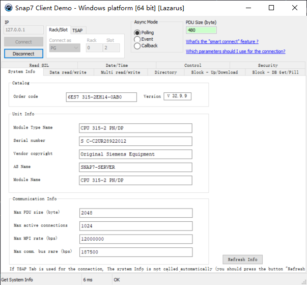

Boofuzz-S7COMM 模糊测试
=======================

前言
----

本篇文章记录如何利用 Boofuzz 框架对西门子 S7 协议展开模糊测试。

**基本环境介绍**

1. 由于笔者没有真实的西门子 PLC，所以采用 Snap7 模拟器替代 PLC。

**目标：**

基于 Boofuzz
实现西门子协议多个功能数据包的模糊测试，具体要模糊测试的功能如下图所示：

   image-20230822093927565

有 Read SZL、Date/Time、Control 等。

由于笔者之前已经对 S7
协议族进行过分析，并编写了协议实现脚本，所以为了方便起见，在模糊测试时对于各原语的默认值就直接导入这些类的成员变量了。

Set up Communication
--------------------

以下是对于建立连接功能数据包的 fuzzing 脚本：

.. code:: python

   # Author: MirRoR4s
   # Created: 2023/8/21
   # Modified: 2023/8/21
   import boofuzz
   from boofuzz import Session, Target, Request, Block, TCPSocketConnection, Bytes, Size
   from TPKT import TPKT
   from COTP import COTP
   from S7Communication import S7Communication

   def h2b(m):
       if isinstance(m, str):
           return bytes.fromhex(m)
       elif isinstance(m, tuple):
           tmp = ''.join(m)
           return bytes.fromhex(tmp)
       else:
           print("Error! The Parameters's Type must be str or tuple.")
           return None

   def define_proto(session: boofuzz.Session, tpkt: TPKT, cotp: COTP, s7comm: S7Communication):
       req = Request("S7COMM-Request", children=(
           Block("TPKT", children=(
               Bytes("Version", default_value=h2b(tpkt.version), size=1, fuzzable=False),
               Bytes("Reserved", default_value=h2b(tpkt.reserved), size=1, fuzzable=False),
               Size("test", block_name="COTP", offset=2, length=2, endian='>', inclusive=True, 
                    fuzzable=False),  # 注意端序，注意长度字段本身也算进总长度内
               #  Bytes("Length", default_value=h2b(tpkt.length), size=2, fuzzable=False)
           )),
           Block("COTP", children=(
               Bytes("Length", default_value=h2b(cotp.length), size=1, fuzzable=False),
               Bytes("PDU Type", default_value=h2b(cotp.pdu_type), size=1, fuzzable=False),
               Bytes("DST Ref", default_value=h2b(cotp.destination_reference), size=2, fuzzable=False),
               Bytes("SRC Ref", default_value=h2b(cotp.source_reference), size=2, fuzzable=False),
               Bytes("Option", default_value=h2b(cotp.opt), size=1, fuzzable=False),
               Bytes("Parameters code", default_value=h2b(cotp.parameters)[:1], size=1, fuzzable=False),
               Bytes("Parameters length", default_value=h2b(cotp.parameters)[:2], size=1, fuzzable=False),
               Bytes("Parameters value", default_value=h2b(cotp.parameters)[:3], size=1, fuzzable=False),

               Block("S7COMM", children=(
                   Bytes("Protocol ID", default_value=h2b(s7comm.protocol_id), size=1, fuzzable=False),
                   Bytes("ROSCTR", default_value=h2b(s7comm.rosctr), size=1, fuzzable=False),
                   Bytes("Reserved", default_value=h2b(s7comm.reserved), size=2, fuzzable=False),
                   Bytes("PDU Reference", default_value=h2b(s7comm.pdu_reference), size=2, fuzzable=False),
                   Bytes("Parameter Length", default_value=h2b(s7comm.parameter_length), size=2, fuzzable=False),
                   Bytes("Data Length", default_value=h2b(s7comm.data_length), size=2, fuzzable=False),
                   Bytes("Parameter", default_value=h2b(s7comm.parameter), fuzzable=False),
                   Bytes("Data", default_value=h2b(s7comm.data), fuzzable=True)  # 对该字段进行模糊测试！
               ))
           )),
       ))

       session.connect(req)

   def main():
       s7comm = S7Communication(
           protocol_id="32", rosctr="01", reserved="0000", pdu_reference="2400", parameter_length="0008",
           data_length="0000", parameter=("f0", "00", "0001", "0001", "01e0"), data=tuple(""))
       cotp = COTP(length="02", pdu_type="f0", opt=tuple("80"), data=s7comm)
       tpkt = TPKT(version="03", reserved="00", length="0019", data=cotp)
       session = Session(
           target=Target(connection=TCPSocketConnection("127.0.0.1", 102)),
           sleep_time=1.0
       )

       define_proto(session, tpkt, cotp, s7comm)

       session.fuzz()

   if __name__ == "__main__":
       main()

关于三个协议实现类的源码放在 my_fuzz 目录下了。
