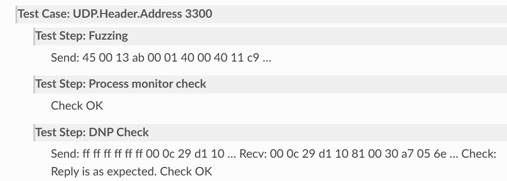

# [Logging](https://boofuzz.readthedocs.io/en/stable/user/logging.html)

Boofuzz 利用各种日志类提供了灵活的日志记录功能，这些日志类都实现了 `IFUzzLogger` 接口。

>  如果想要同时使用多个日志，可参看 `FuzzLogger`

## [Logging Interface (IFuzzLogger)](https://boofuzz.readthedocs.io/en/stable/_modules/boofuzz/ifuzz_logger.html#IFuzzLogger)

IFuzzLogger 是一个用于记录 fuzz 数据的抽象类，当进行模糊测试时，主要有以下三个用法：

1. 打开测试用例
2. 打开测试步骤
3. 使用其它记录方法

IFuzzLogger 提供了 Sulley 框架的记录接口和测试 writers。提供的方法旨在反映功能测试操作。 IFuzzLogger 提供了一种记录测试用例、通过、失败、测试步骤等的方法，而不是通用的调试/信息/警告方法。

下面的示例显示了记录器的用法：



每个 fuzz case 都会打开一个 test case，每个 test case 又包含多个 test step。通常 test step 的取值如下：

- Fuzzing
- Set up（pre-fuzzing）
- Post-test cleanup
- Instrumentation checks
- Reset due to failure

在一个 test step 内，一个 test 测试也许会记录发送的数据、收到的数据、check、check results 以及其它的信息。

### 分析

#### [close_test()](https://boofuzz.readthedocs.io/en/stable/_modules/boofuzz/ifuzz_logger.html#IFuzzLogger.close_test)

close_test 是测试完成之后会调用的方法，可以利用其来通知操作者或者是将测试日志保存起来。

**源码：**

- ```python
    @abc.abstractmethod
      def close_test(self):
          """
          Called after a test has been completed. Can be used to inform the operator
          or save the test log.
  
          :param: None
          :type: None
  
          :return: None
          :rtype: None
          """
          raise NotImplementedError
  ```

  


#### [close_test_case()](https://boofuzz.readthedocs.io/en/stable/_modules/boofuzz/ifuzz_logger.html#IFuzzLogger.close_test_case)

同 close_test

**源码：**

- ```python
      @abc.abstractmethod
      def close_test_case(self):
          """
          Called after a test case has been completed. Can be used to inform the operator
          or save the test case log.
  
          :param: None
          :type: None
  
          :return: None
          :rtype: None
          """
          raise NotImplementedError
  ```

  

#### [log_check(description)](https://boofuzz.readthedocs.io/en/stable/_modules/boofuzz/ifuzz_logger.html#IFuzzLogger.log_check)

在测试时记录对目标系统的检查情况。

**参数：**

- description（str）- 接收到的数据

**返回值：**

- None

**源码：**

- ```python
      @abc.abstractmethod
      def log_check(self, description):
          """
          Records a check on the system under test. AKA "instrumentation check."
  
          :param description: Received data.
          :type description: str
  
          :return: None
          :rtype: None
          """
          raise NotImplementedError
  ```


#### [log_error(description)](https://boofuzz.readthedocs.io/en/stable/_modules/boofuzz/fuzz_logger_text.html#FuzzLoggerText.log_error)

该方法用于记录一个内部错误，并通知操作员测试（test）未能成功完成。

**参数：**

- description（str）- 接收到的数据

**返回值：**

- None

**源码：**

- ```
      @abc.abstractmethod
      def log_error(self, description):
          """
          Records an internal error. This informs the operaor that the test was
          not completed successfully.
  
          :param description: Received data.
          :type description: str
  
          :return: None
          :rtype: None
          """
          raise NotImplementedError
  ```


#### [log_fail(descript="")](https://boofuzz.readthedocs.io/en/stable/_modules/boofuzz/ifuzz_logger.html#IFuzzLogger.log_fail)

记录一个失败的检查（check），该方法会将一个模糊测试用例标识为潜在的 bug 或异常。

**参数：**

- description（str）- 可选的补充数据

**返回值：**

- None

**源码:**

- ```
      @abc.abstractmethod
      def log_fail(self, description=""):
          """
          Records a check that failed. This will flag a fuzzing case as a
          potential bug or anomaly.
  
          :param description: Optional supplementary data.
          :type description: str
  
          :return: None
          :rtype: None
          """
          raise NotImplementedError
  ```

  


> boofuzz.IFuzzLoggerBackend 是 IFuzzLogger 的别名

## [Console-GUI Logging](https://boofuzz.readthedocs.io/en/stable/user/logging.html#console-gui-logging)

`FUzzLoggerCurses` 类使用 curses 库创建一个控制台 GUI 并格式化 FuzzLogger 数据放入控制台中显示。

- 该类还未在 Windows 下进行测试

> INDENT_SIZE = 2

### **参数：**

- web_port（int）- web 接口的端口号，默认是 26000
- window_height（int）- 默认的控制台高度，默认是 40
- window_width（int）- 默认的控制台宽度，默认是 130
- auto_scroll（bool）- 
- max_log_lines（int）- 保持在内部存储中的最大记录行数，超出此值的额外行将不会显示出来，默认是 500
- wait_on_quit（bool）- 当主进程即将关闭时是否要保持 GUI 的打开状态并等待用户输入，默认为 True
- min_refresh_rate（int）- 在检测终端尺寸重新调整的过程中，每次检测之间的延迟时间。默认值为1000毫秒（1秒），每次递增100毫秒
- bytes_to_str（function）- 将发送或接收到的字节数据转为用于记录的字符串数据

**返回值：**

- 一个 FuzzLoggerCurses 对象

**实现思路：**

- 成员变量赋值：

  ```python
          self._title = "boofuzz"
          self._web_port = web_port
          self._max_log_lines = max_log_lines
          self._auto_scroll = auto_scroll
          self._current_data = None
          self._log_storage = []
          self._fail_storage = []
          self._wait_on_quit = wait_on_quit
          self._quit = False
          self._status = STATUS_RUNNING
          self._refresh_interval = min_refresh_rate
          self._event_resize = True
          self._event_log = False
          self._event_case_close = False
          self._event_crash = False
  
          self._total_index = 0
          self._total_num_mutations = 0
          self._current_name = ""
          self._current_index = 0
          self._current_num_mutations = 0
  
          self._format_raw_bytes = bytes_to_str
          self._version = helpers.get_boofuzz_version(helpers)
  ```


## Text Logging

文本记录对应着 FuzzLoggerText 类，该类会将 FuzzLogger 数据格式化成文本形式并输出到标准输出或是文件中。如果想要既输出到 STDOUT 又输出到文件中，可以使用两个 FUzzLoggerTexts。

**参数：**

- file_handle (io.BinaryIO) - 一个用于日志记录的文件句柄，默认值为`sys.stdout`，也就是标准输出流
- bytes_to_str (Fucntion) - 用于将发送/接收的字节数据转换为字符串以进行日志记录，默认值为 [DEFAULT_HEX_TO_STR](https://boofuzz.readthedocs.io/en/stable/_modules/boofuzz/helpers.html#hex_str)

**返回值：**

**实现思路：**

- 成员变量赋值

  ```python
      def __init__(self, file_handle=sys.stdout, bytes_to_str=DEFAULT_HEX_TO_STR):
          """
          :type file_handle: io.BinaryIO
          :param file_handle: Open file handle for logging. Defaults to sys.stdout.
  
          :type bytes_to_str: function
          :param bytes_to_str: Function that converts sent/received bytes data to string for logging.
          """
          self._file_handle = file_handle
          self._format_raw_bytes = bytes_to_str
  ```

  

